---
## Front matter
lang: ru-RU
title: Лабораторная работа №7.
subtitle: 
author:
  - Карапетян Мари Рафаеловна
institute:
  - Российский университет дружбы народов, Москва, Россия
date: 21 марта 2024

## Formatting
mainfont: PT Serif
romanfont: PT Serif
sansfont: PT Sans
monofont: PT Mono
toc: false
slide_level: 2
theme: metropolis
header-includes:
- \metroset{progressbar=frametitle,sectionpage=progressbar, numbering=fraction}
- '\makeatletter'
- '\beamer@ignorenonframefalse'
- '\makeatother'
aspectratio: 43
section-titles: true

---

# Цели и задачи работы

## Цели и задачи

Ознакомление с файловой системой Linux, её структурой, именами и содержанием
каталогов. Приобретение практических навыков по применению команд для работы
с файлами и каталогами, по управлению процессами (и работами), по проверке исполь-
зования диска и обслуживанию файловой системы.

# Процесс выполнения лабораторной работы

## Скопировала файл в домашний каталог,переименовала и переместила его в каталог ~/ski.places

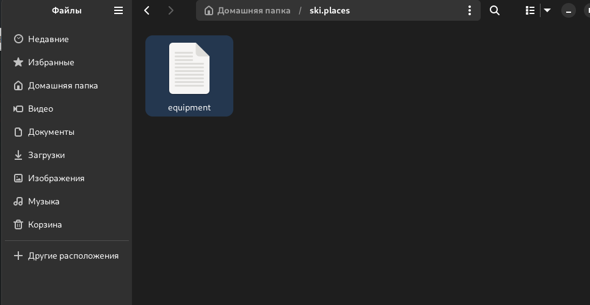{#fig:001 width=70%}

## Переименовала файл ~/ski.places/equipment в ~/ski.places/equiplist.

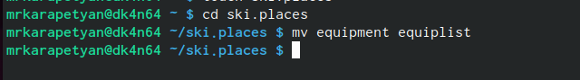{#fig:002 width=70%}

## Создала файл аbс1,скопировала его в каталог
~/ski.places и назовала ero equiplist2.

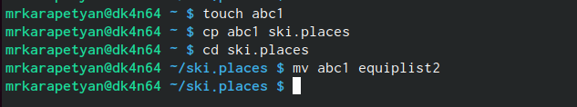{#fig:003 width=70%}
    
## Создала каталог с именем equipment.Переместила файлы.

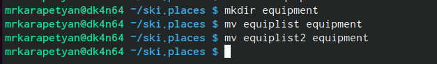{#fig:004 width=70%}

## Создала и переместила каталог ~/newdir в каталог ~/ski.places,назвала его plans.

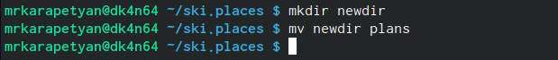{#fig:005 width=70%}

## Определила опции команды chmod

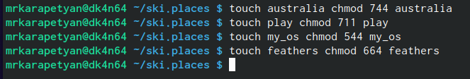{#fig:006 width=70%}

## Просмотрела содержимое файла с помощью команды cat 

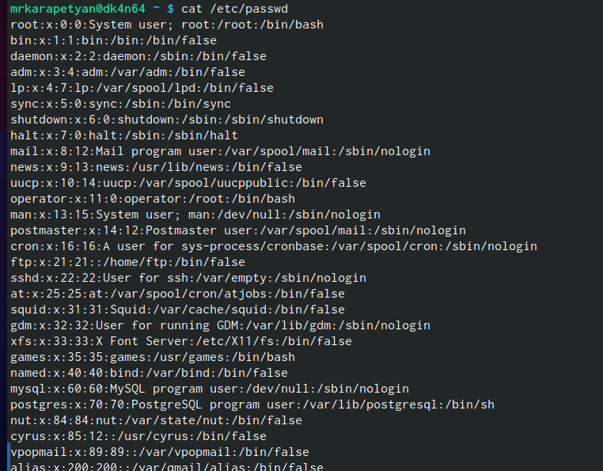{#fig:007 width=70%}

## Переместила файл ~/file.old в каталог ~/play и скопировала каталог ~/play в каталог ~/fun.

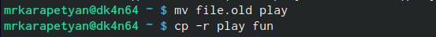{#fig:008 width=70%}

## Переместила каталог ~/fun в каталог ~/play и назвала ero-games.

{#fig:009 width=70%}

## Лишила владельца файла ~/feathers права на чтение.

{#fig:010 width=70%}

## Просмотрим файл ~/feathers командой cat 

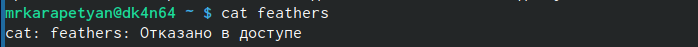{#fig:011 width=70%}
    
## Попытаемся скопировать файл  ~/feathers
    
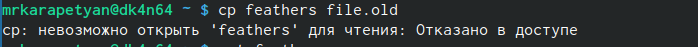{#fig:012 width=70%}

## Возвращаем владельцу файла ~/feathers право на чтение.

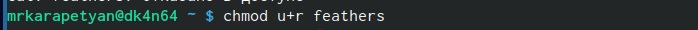{#fig:013 width=70%}

## Лишила владельца каталога ~/play права на выполнение.

{#fig:014 width=70%}

## Перешла в  каталог ~/play. Возвращаем владельцу каталога ~/play право на выполнение

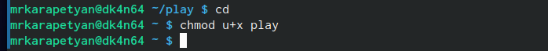{#fig:015 width=70%}

## Краткое описание команд и примеры:
 • mount: Команда mount используется для подключения файловых систем к определенным точкам монтирования в иерархии файловой системы. Пример: mount / dev/sdb1 /mnt (подключение устройства / dev/sdb1 к точке монтирования /mnt).
 • fsck: Команда fsck используется для проверки и восстановления целостности файловой системы. Пример: fsck / dev/sda1 (проверка и восстановление файловой системы на устройстве / dev/sda1).
 • mkfs: Команда mkfs используется для создания файловой системы на устройстве. Пример: mkfs.ext4 / dev/sdb1 (создание файловой системы ext4 на устройстве /dev/sdb1).
 • kill: Команда kill используется для отправки сигнала процессу, что приводит к его завершению. Пример: kill -9 1234 (отправка сигнала SIGKILL процессу с идентификатором 1234, что приведет к его немедленному завершению).

## Выводы

Мы приобрели практические навыки по применению команд для работы
с файлами и каталогами, по управлению процессами (и работами), по проверке исполь-
зования диска и обслуживанию файловой системы.
