---
## Front matter
title: "Лабораторная работа №7"
subtitle: "Анализ файловой системы Linux.Команды для работы с файлами и каталогами"
author: "Карапетян Мари Рафаеловна"

## Generic otions
lang: ru-RU
toc-title: "Содержание"

## Bibliography
bibliography: bib/cite.bib
csl: pandoc/csl/gost-r-7-0-5-2008-numeric.csl

## Pdf output format
toc: true # Table of contents
toc-depth: 2
lof: true # List of figures
lot: true # List of tables
fontsize: 12pt
linestretch: 1.5
papersize: a4
documentclass: scrreprt
## I18n polyglossia
polyglossia-lang:
  name: russian
  options:
	- spelling=modern
	- babelshorthands=true
polyglossia-otherlangs:
  name: english
## I18n babel
babel-lang: russian
babel-otherlangs: english
## Fonts
mainfont: PT Serif
romanfont: PT Serif
sansfont: PT Sans
monofont: PT Mono
mainfontoptions: Ligatures=TeX
romanfontoptions: Ligatures=TeX
sansfontoptions: Ligatures=TeX,Scale=MatchLowercase
monofontoptions: Scale=MatchLowercase,Scale=0.9
## Biblatex
biblatex: true
biblio-style: "gost-numeric"
biblatexoptions:
  - parentracker=true
  - backend=biber
  - hyperref=auto
  - language=auto
  - autolang=other*
  - citestyle=gost-numeric
## Pandoc-crossref LaTeX customization
figureTitle: "Рис."
tableTitle: "Таблица"
listingTitle: "Листинг"
lofTitle: "Список иллюстраций"
lotTitle: "Список таблиц"
lolTitle: "Листинги"
## Misc options
indent: true
header-includes:
  - \usepackage{indentfirst}
  - \usepackage{float} # keep figures where there are in the text
  - \floatplacement{figure}{H} # keep figures where there are in the text
---

# Цель работы

Ознакомление с файловой системой Linux, её структурой, именами и содержанием
каталогов. Приобретение практических навыков по применению команд для работы
с файлами и каталогами, по управлению процессами (и работами), по проверке исполь-
зования диска и обслуживанию файловой системы.

# Задание

1. Выполните следующие действия, зафиксировав в отчёте по лабораторной работе
используемые при этом команды и результаты их выполнения:
2. Скопируйте файл /usr/include/sys/io.h в домашний каталог и назовите его
equipment. Если файла io.h нет, то используйте любой другой файл в каталоге
/usr/include/sys/ вместо него.
- В домашнем каталоге создайте директорию ~/ski.plases.
- Переместите файл equipment в каталог ~/ski.plases.
- Переименуйте файл ~/ski.plases/equipment в ~/ski.plases/equiplist.
- Создайте в домашнем каталоге файл abc1 и скопируйте его в каталог
~/ski.plases, назовите его equiplist2.
- Создайте каталог с именем equipment в каталоге ~/ski.plases.
- Переместите файлы ~/ski.plases/equiplist и equiplist2 в каталог
~/ski.plases/equipment.
3. Создайте и переместите каталог ~/newdir в каталог ~/ski.plases и назовите
его plans.
Определите опции команды chmod, необходимые для того, чтобы присвоить перечис-
ленным ниже файлам выделенные права доступа, считая, что в начале таких прав
нет:
drwxr--r-- ... australia
drwx--x--x ... play
-r-xr--r-- ... my_os
-rw-rw-r-- ... feathers
При необходимости создайте нужные файлы.
4. Проделайте приведённые ниже упражнения, записывая в отчёт по лабораторной
работе используемые при этом команды:
- Просмотрите содержимое файла /etc/password.
- Скопируйте файл ~/feathers в файл ~/file.old.
- Переместите файл ~/file.old в каталог ~/play.
- Скопируйте каталог ~/play в каталог ~/fun.
- Переместите каталог ~/fun в каталог ~/play и назовите его games.
- Лишите владельца файла ~/feathers права на чтение.
- Что произойдёт, если вы попытаетесь просмотреть файл ~/feathers командой
cat?
- Что произойдёт, если вы попытаетесь скопировать файл ~/feathers?
- Дайте владельцу файла ~/feathers право на чтение.
- Лишите владельца каталога ~/play права на выполнение.
- Перейдите в каталог ~/play. Что произошло?
- Дайте владельцу каталога ~/play право на выполнение.
5. Прочитайте man по командам mount, fsck, mkfs, kill и кратко их охарактеризуйте,
приведя примеры

# Выполнение лабораторной работы

1. Скопировала файл в домашний каталог,переименовала и переместила его в каталог ~/ski.places

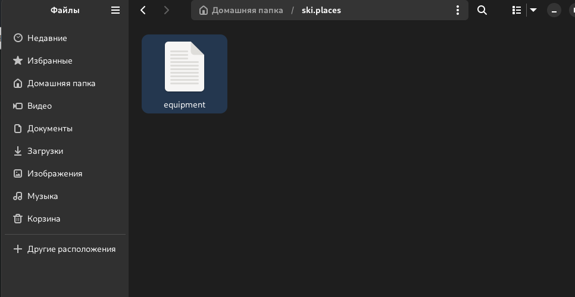{#fig:001 width=70%}

2. Переименовала файл ~/ski.places/equipment в ~/ski.places/equiplist.

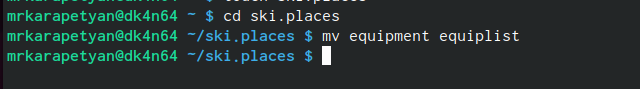{#fig:002 width=70%}

3.  Создала файл аbс1,скопировала его в каталог
~/ski.places и назовала ero equiplist2.

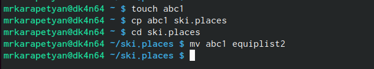{#fig:003 width=70%}
    
4. Создала каталог с именем equipment в каталоге ~/ski.places.Переместила файлы ~/ski.places/equiplist и equiplist2 в каталог ~/ski.plases/equipment.

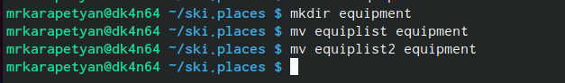{#fig:004 width=70%}

5. Создала и переместила каталог ~/newdir в каталог ~/ski.places,назвала его plans.

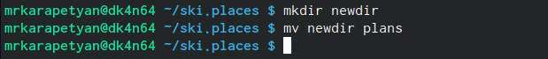{#fig:005 width=70%}

6. Определила опции команды chmod

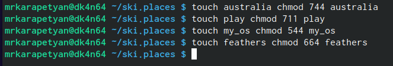{#fig:006 width=70%}

7. Просмотрела содержимое файла с помощью команды cat 

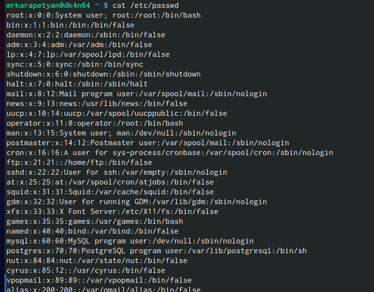{#fig:007 width=70%}

8. Переместила файл ~/file.old в каталог ~/play и скопировала каталог ~/play в каталог ~/fun.

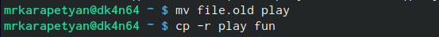{#fig:008 width=70%}

9. Переместила каталог ~/fun в каталог ~/play и назвала ero-games.

{#fig:009 width=70%}

10. Лишила владельца файла ~/feathers права на чтение.

{#fig:010 width=70%}

11. Просмотрим файл ~/feathers командой cat 

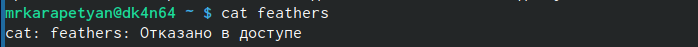{#fig:011 width=70%}
    
12. Попытаемся скопировать файл  ~/feathers
    
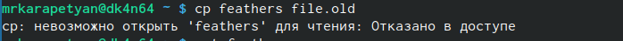{#fig:012 width=70%}

13. Возвращаем владельцу файла ~/feathers право на чтение.

{#fig:013 width=70%}

14. Лишила владельца каталога ~/play права на выполнение.

{#fig:014 width=70%}

15. Перешла в  каталог ~/play. Возвращаем владельцу каталога ~/play право на выполнение

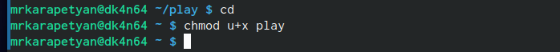{#fig:015 width=70%}

5. Краткое описание команд и примеры:
 • mount: Команда mount используется для подключения файловых систем к определенным точкам монтирования в иерархии файловой системы. Пример: mount / dev/sdb1 /mnt (подключение устройства / dev/sdb1 к точке монтирования /mnt).
 • fsck: Команда fsck используется для проверки и восстановления целостности файловой системы. Пример: fsck / dev/sda1 (проверка и восстановление файловой системы на устройстве / dev/sda1).
 • mkfs: Команда mkfs используется для создания файловой системы на устройстве. Пример: mkfs.ext4 / dev/sdb1 (создание файловой системы ext4 на устройстве /dev/sdb1).
 • kill: Команда kill используется для отправки сигнала процессу, что приводит к его завершению. Пример: kill -9 1234 (отправка сигнала SIGKILL процессу с идентификатором 1234, что приведет к его немедленному завершению).

# Выводы

Мы приобрели практические навыки по применению команд для работы
с файлами и каталогами, по управлению процессами (и работами), по проверке исполь-
зования диска и обслуживанию файловой системы.

# Контрольные вопросы
1. Файловая система в Linux состоит из фалов и каталогов. Каждому физическому носи-
телю соответствует своя файловая система.
Существует несколько типов файловых систем. Перечислим наиболее часто встречаю-
щиеся типы:
– ext2fs (second extended filesystem);
– ext2fs (third extended file system);
– ext4 (fourth extended file system);
– ReiserFS;
– xfs;
– fat (file allocation table);
– ntfs (new technology file system).
2. Общая структура файловой системы Linux включает корневой каталог "/", в котором содержатся основные системные и пользовательские каталоги. Некоторые из основных директорий первого уровня включают /bin (для исполняемых файлов), / etc (для конфигурационных файлов), /home (для домашних каталогов пользователей), /var (для переменных данных), / tmp (для временных файлов) и другие.
3. Чтобы содержимое файловой системы было доступно операционной системе, необходимо выполнить операцию монтирования (mount), которая связывает файловую систему с определенной точкой в файловой иерархии
4. Основные причины нарушения целостности файловой системы включают сбои питания, отказы оборудования, ошибки в программном обеспечении и другие факторы. Для восстановления поврежденной файловой системы можно использовать инструменты, такие как fsck (file system check), которые могут исправить ошибки и восстановить целостность файловой системы.
5. Файловая система создается при форматировании раздела диска с использованием соответствующей команды, например, mkfs.ext4 для создания ext4 файловой системы.
6.Для просмотра текстовых файлов в Linux можно использовать команды cat, less, more, head, tail и другие.
7. Команда cp используется для копирования файлов и каталогов.
Формат команды:
cp [-опции] исходный_файл целевой_файл
8. Команда mv в Linux используется для перемещения (переименования) файлов и каталогов. Основные возможности команды mv включают перемещение файлов и каталогов из одного места в другое, а также переименование файлов и каталогов.
9. Права доступа в операционной системе Linux определяют, кто может читать, записывать и выполнять файлы и каталоги. Они могут быть изменены с помощью команды "chmod" для изменения прав доступа к файлам и каталогам. Права доступа в Linux обычно представлены в виде комбинации букв и символов, таких как "r" (read - чтение), "w" (write - запись) и "x" (execute - выполнение), а также числовых значений, представляющих разрешения для владельца файла, группы и других пользователей. Дополнительные источники информации по этой теме могут включать официальную документацию Linux и специализированные руководства по управлению правами доступа в Linux.
